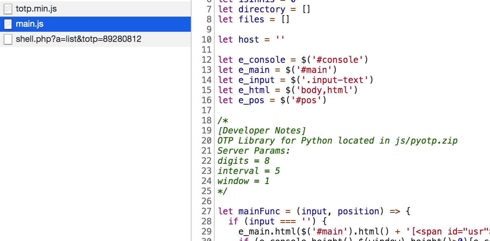
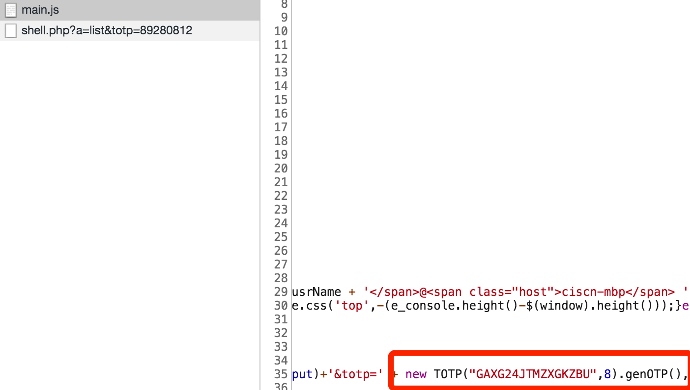
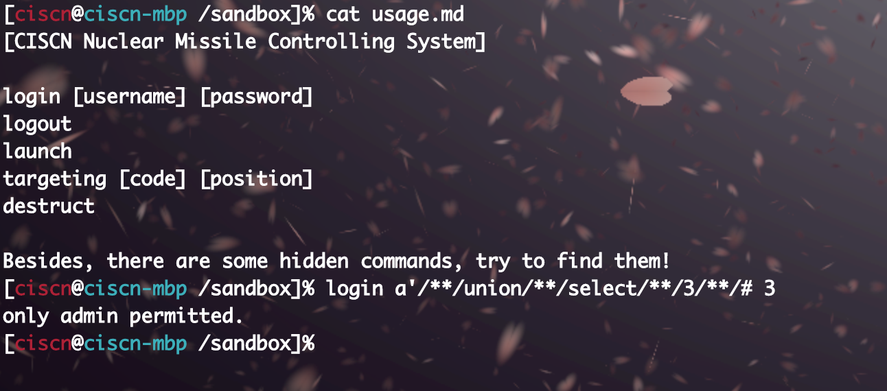
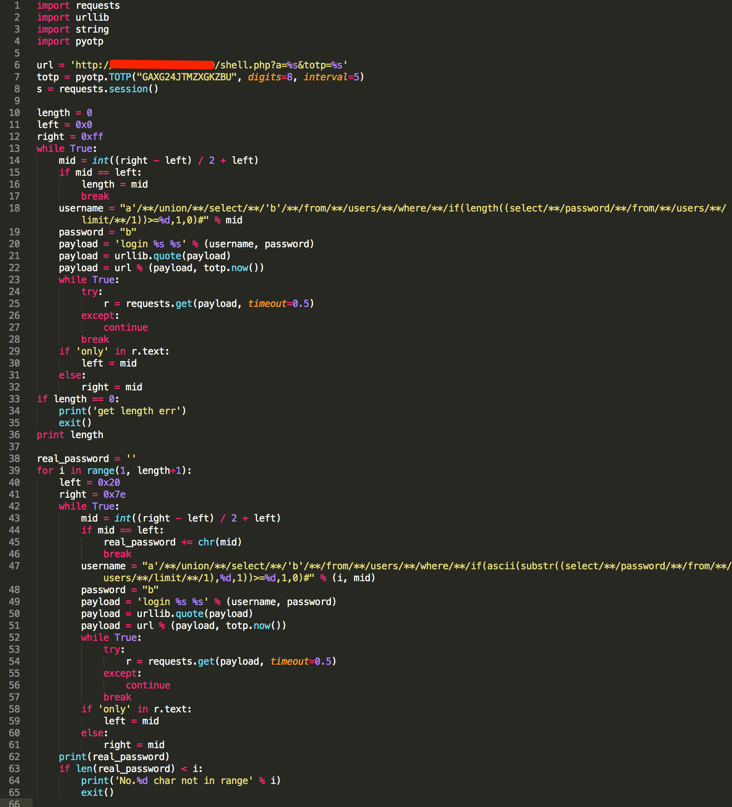
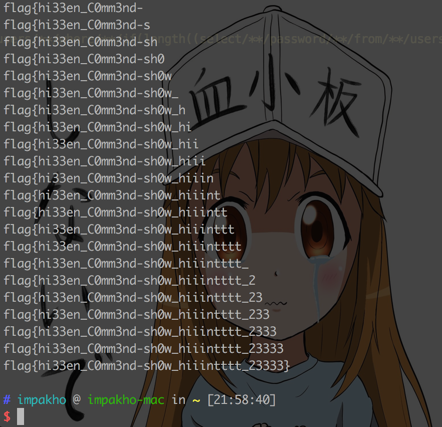
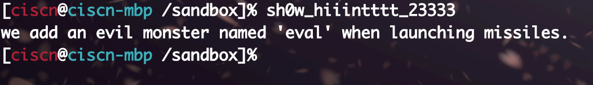
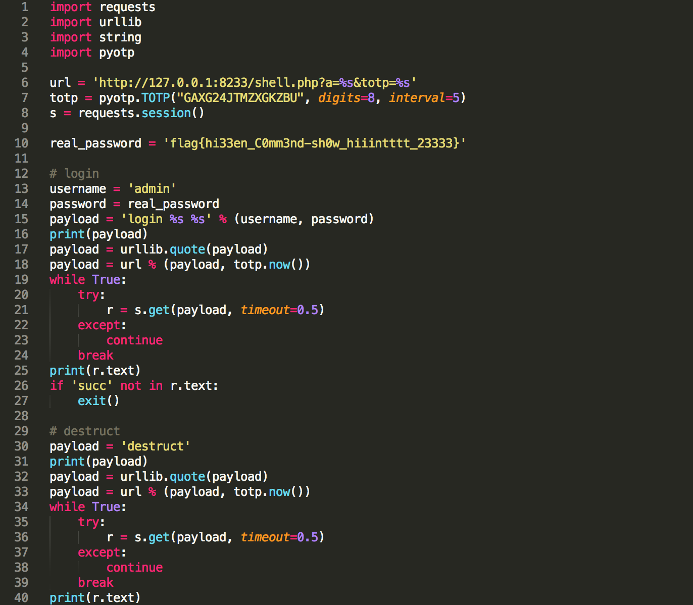
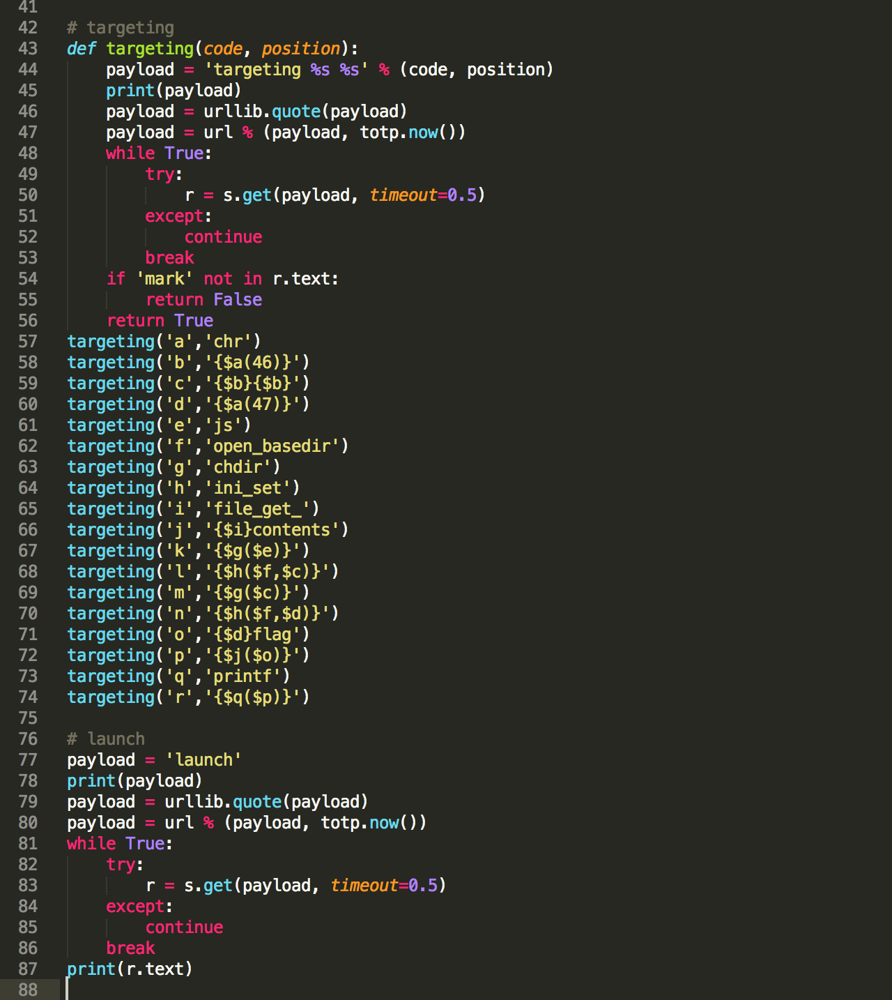
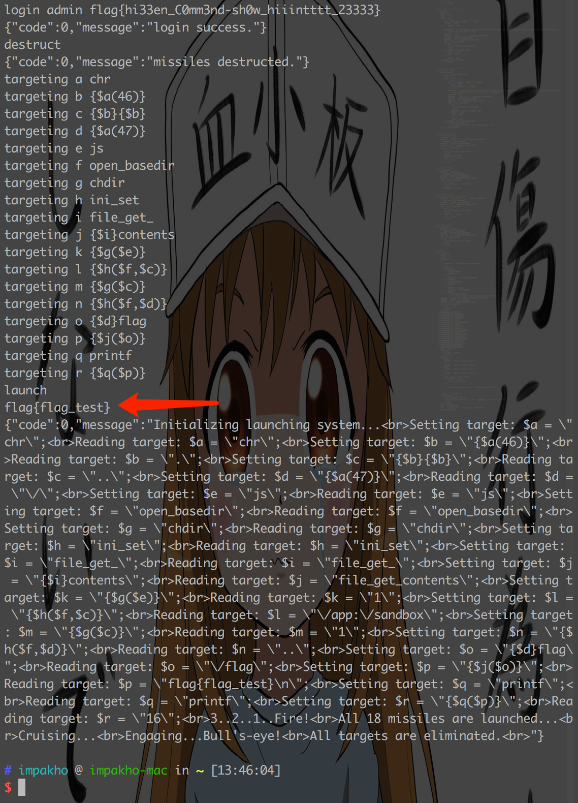

# 国赛2019分区赛 - giftbox (后来据说是西北赛区Web5)

## 题目信息：

* 题目名称：giftbox
* 预估难度：中等偏难

## 题目描述：

```
送给小蛮腰的礼物，她是一个美丽的姑娘。
```

## 题目考点：

```
1. otp计算
2. sql注入爆破
3. php可变变量和php内置函数
4. open_basedir绕过
```

## 思路简述：

先审计网页源代码，能够实现 `otp` 的计算，然后 `sql注入` 写脚本爆破得到 `admin` 的密码，登录后可以进行有限制的 `eval` 任意代码执行，利用 `php可变变量` 和 `php内置函数` 可以构造 `payload` 来实现任意代码执行，然后就可以对漏洞源代码进行 `fix` 。不过系统命令函数被禁用，无法执行系统命令来读取 `flag` ，所以还需要使用 `chdir` 和 `ini_set` 绕过 `open_basedir` 限制来读取到根目录下的 `flag` 文件。

## 题目提示：

1. Tw0 Fact0r Auth
2. login first
3. {$a}
4. chdir&ini_set

## 原始 flag 及更新命令：

```
# 原始 flag
flag{flag_test}

# 更新 flag 命令
echo 'flag{85c2a01a-55f7-442a-8712-3f6908e1463a}' > /flag
或
docker exec -i -t xxxxxxxxxx bash -c "echo flag{85c2a01a-55f7-442a-8712-3f6908e1463a} > /flag"
```

## 题目环境：

```
1. ubuntu 18.04 LTS
2. Apache/2.4.18 (Ubuntu)
3. PHP 7.3.3
4. MySQL 5.7.25
```

## 题目制作过程：

1. 设计好漏洞，编写php相关代码
2. 按照“Docker示例文档.md”来编写Dockerfile，制作好镜像。

## 题目writeup：



在源代码 `main.js` 里找到一个提示，提供了 `otp` 的 `python` 库和 `totp` 的参数，方便写脚本。



同样是 `main.js` 里，可以找到用来生成 `totp` 的 `key` 。

出题人注：服务端时间与客户端时间相差大于 `15秒`，需要先计算正确的 `totp` 才能调用 `shell.php` 。



查看 `usage.md` 可以看到命令用法， `login` 存在注入。





写个脚本爆破得到密码：`flag{hi33en_C0mm3nd-sh0w_hiiintttt_23333}`



密码里提示有个隐藏命令 `sh0w_hiiintttt_23333` ，可以得到提示 `eval` 在 `launch` 的时候被调用。

`launch` 前需要先用 `targeting` 设置，不过对输入有限制，这里可以 `fuzz` 一下，得知 `code` 限制 `a-zA-Z0-9` ， `position` 限制 `a-zA-Z0-9})$({_+-,.` ，而且两者的长度也有限制。

这里需要用 `php可变变量`  构造和拼接 `payload` 。







构造用来 `getflag` 的 `payload` ，绕过 `open_basedir` 的限制，写个脚本就能 `getflag` 。

Flag：`flag{flag_test}`

## 注意事项

1. 题目名称不要有特殊符号，可用下划线代替空格；
2. 根据设计的赛题，自行完善所有文件夹中的信息；
3. 此文件夹下信息未完善的队伍，将扣除一定得分。